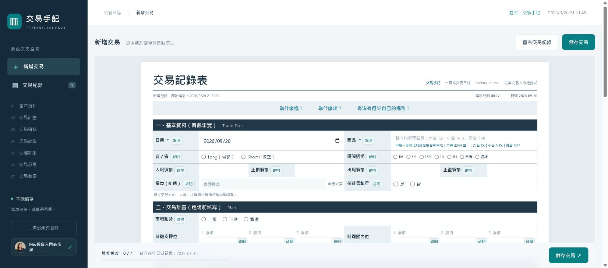
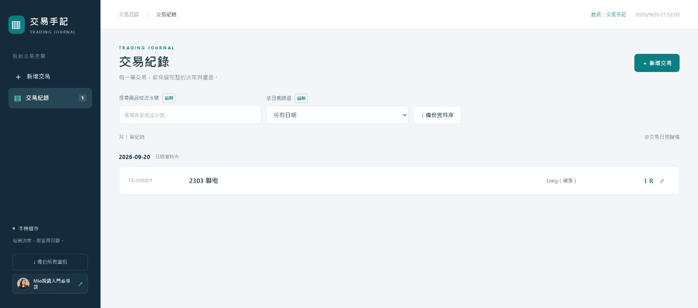
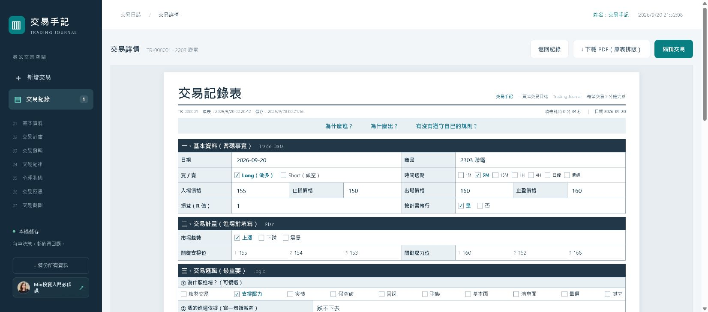

# MIOTXREC｜交易手記

Windows 與 macOS 本機版投資交易紀錄表。交易資料只儲存在自己的電腦，支援股票代號自動完成、交易紀錄、PDF 匯出、資料庫備份及每日登入提示。

## 下載安裝

| 系統 | 安裝檔 | 使用方式 |
|---|---|---|
| Windows 10／11 | [下載 Windows 安裝包](安裝檔/MIOTXREC-Windows-Installer.zip) | 完整解壓縮後，雙擊 `一鍵啟動.cmd` |
| macOS（Intel／Apple Silicon） | [下載 macOS 安裝包](安裝檔/MIOTXREC-macOS-Installer.zip) | 完整解壓縮後，對 `一鍵啟動.command` 按右鍵選擇「打開」 |

這是輕量安裝版本，不包含預裝套件或任何人的交易資料。第一次啟動時需要網路：Windows 會依需要下載 Python 執行環境與 PDF 元件；macOS 需由使用者先安裝 Python 3.10 以上版本，程式再安裝 PDF 元件。

啟動後會自動開啟瀏覽器，預設網址為 `http://127.0.0.1:33968/`。

## 完整說明

[開啟精美版 README.HTML](README.HTML)

請先完整解壓縮安裝包，不要直接在 ZIP 壓縮檔內執行。首次啟動會建立全新的空白資料庫。

## 畫面預覽

### 每日首次登入

### 新增交易

### 交易紀錄

### 交易詳情與 PDF

## 資料與隱私

- 交易資料位於安裝資料夾內的 `資料/交易紀錄.sqlite3`。
- 服務僅監聽本機 `127.0.0.1`，不對區域網路或外網開放。
- 建議定期使用左側「備份所有資料」保存資料庫備份。
- 開啟 Mio 投資入門必修課、更新商品清單或安裝缺少元件時才需要連線網路。
